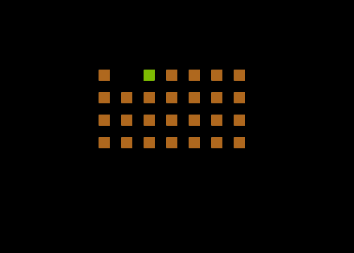

# Sigils

By Kim Slawson, February – March 2022

*NOMAM* 2022 10-Line BASIC competition entry (EXTREME-256 category)

Requires an Atari 8-bit machine or emulator running TurboBASIC XL (800XL minimum)

The provided disk image contains TurboBASIC XL and automatically runs the game.

## The pitch
It's connect the dots, but more interesting. You form symbols (sigils) as you play. Also, there are gratuitous crashing noises.

## To play&nbsp;🕹️
Use the joystick to move from dot to dot, drawing a line as you go. The pitch of the sound is (inversely) proportional to the length of the line (like stretching a rubber band). If you get stuck or just want to retry a level, push fire. To get back to the main menu, hit reset (this also applies to the level editor).

## Wait, did you say level editor&nbsp;⁉️
Yes, Virginia, there is a level editor. When you master all of the included levels, have fun making your own. Draw dots until you're ready to play, then hold down fire for more than a second. The screen will flash, indicating you're now playing your homemade level. If you get stuck or just want to retry your creation, push fire.

## Colophon&nbsp;&nbsp;🧰
Sigils was developed on a Macbook Pro and tested using Atari800MacX and on my childhood Atari 130XE. Shoutouts to the following AtariAge users: @dmsc for basicParser, @skr for MacTurban, @luckybuck for Sublime Text integration and @mozzwald and @tschak909 for FujiNet /|\ 

## Source code&nbsp;&nbsp;💻
If you're curious, check out the commented source code below. You may also wish to look at the obfuscated source code (if you dare). Use the source, Luke!
<details>
 <summary><strong>Readable listing with comments</strong></summary>
 <p>

```basic
REM Sigils
REM written for 2022 NOMAM Ten-line BASIC competition
REM built with Turban (TURboBAsic Nifty)
REM obsfuscated using tbxlparser
REM requires Turbo-BASIC XL
REM by Kim Slawson
REM 2022-02-22


rem OUTLINE:
rem set up
rem   encode strings
rem title
rem   get level number
rem loop
rem   clear
rem   play level
rem     if level editor
rem       build level, start level on hold
rem       store level in array
rem     elseif normal level
rem       draw level (recall from array if user-created)
rem       play level, retry level on fire
rem       increment level when done
rem rerun for setup & menu again

poke 580,1:rem ensure that RESET does cold start rather than warm start
poke 82,0:rem no margin

rem dimension the string for level storage
rem dimension the 2D array to remember user-created levels
rem dimension the arrays to hold level widths and x,y starting positions
dim level$(255),l(16,8),wid(10),x(10),y(10)

rem encode levels into string, prepended by substring lengths by level
rem size, startx, starty, then bit-encoded columns as chars (8 bits high by size bits wide) 
rem lvl: 1      2                    3           4                 5                          6                    7                             8                 9              10
level$=["<8<<<<<\1C\14\1C\08\1C\14\1C\38\1C\3C\38\30\38\2C\7E\7E\20\FF\FF\FF\FE\FE\FE\FC\FC\FC\1C\1C\7F\77\7F\1C\1C\1C\36\3E\1C\1C\04\1C\1C\04\1C\7E\5A\7E\7E\5A\7E\0F\3B\2E\3B\0F\0C\0C\0E\1B\7F\CE\80\FC\FE\FE\7E\78\40\CE\82\FE"]

Gr.3:rem mode 3 with text window for titles and instructions
poke 710,0:rem black text window

rem draw title
color 1
for y=0 to 2
  for x=0 to 9
    plot x*2+11,y*2
  next x
next y
color 0:plot 25,0:plot 25,2
color 2
repeat
  rem get title coordinates out of DATA
  read x,y
  rem negative x coordinate means plot, positive means drawto (plus x offset to center)
  if x<0:plot abs(x)+11,y:else:drawto x+11,y:endif
  pause 5:rem slow down title sequence
until (x=16 and y=4)

rem pick a level, or edit your own! 
rem rerun on bad input
trap #run
? ["  ~{lbar}1~{lbar}Easy ~{lbar}2~{lbar}Glasses ~{lbar}3~{lbar}House ~{lbar}4~{lbar}Four"]
? ["  ~{lbar}5~{lbar}City ~{lbar}6~{lbar}Cross ~{lbar}7~{lbar}Key ~{lbar}8~{lbar}Holes"]
? ["  ~{lbar}9~{lbar}Skull ~{lbar}10~{lbar}Yorgle ~{lbar}0~{lbar}Level editor"]
input "Level";level:cls

rem read level starting positions into x and y arrays
for i=1 to 10:read w,x,y:wid(i)=w:x(i)=x:y(i)=y:next i

rem main game loop
do
	rem clear the screen
	Gr.3:rem mode 3 with text window for titles and instructions
	poke 710,0:rem black text window
	poke 752,1:rem get rid of cursor

	rem did the user pick the level editor?
	if level=0 and remaining=0
	    ? ,"Design your own level!"
	    ? [" ~{lbar}FIRE~{lbar}to plot/erase, hold~{lbar}FIRE~{lbar}to play"]

		rem set starting point
		pause 30
		x=4:y=4:btime=time:mtime=time:oc=0:rem initialize cursor and times
		
		while 2-done-b
			rem blink the cursor
		  if time-btime>10:btime=time:b=1-b:color b*2-oc*b:plot x,y:endif

			REM get joystick position
			S=STICK(0)
	    dy=((S=13)-(S=14))*2
	    dx=((S=7)-(S=11))*2

	    rem look ahead to next spot
    	ny=y+dy:nx=x+dx
	    ny=y+dy*((ny>3) and (ny<19)):nx=x+dx*((nx>3) and (nx<35))

	    rem synchronize the movement in lockstep with timer
	    if time-mtime>20 and (dx or dy)
	    	rem redraw original spot and draw next spot
        color oc:plot x,y
        x=nx:y=ny
        locate x,y,oc
        color 2:plot x,y
        mtime=time
	    endif
	    if strig(0)=0
	      mtime=time:oc=1-oc:remaining=remaining+(oc*2-1):rem reset the move timer, increment the number of dots
	      repeat:until strig(0)
	      if time-mtime>60:rem if the user holds fire for more than a second, we're done
	        done=1
	        poke 712,180:poke 710,180:pause 10:poke 712,0:poke 710,0:rem flash the screen to confirm user is done
	      endif
	    endif
		wend

		rem remember position
		x(0)=x:y(0)=y

		rem read level into array in case of user reset
		for x=0 to 15
			for y=0 to 7
				locate 4+x*2,4+y*2,oc
				l(x,y)=oc>0
			next y
		next x
	endif

	rem draw the level
	remaining=0:o=0
	if level=0
		rem recall user-created level from 2D array
		for x=0 to 15
			for y=0 to 7
				oc=l(x,y)
				color oc
				plot 4+x*2,4+y*2
				remaining=remaining+oc:rem increment the number of dots
			next y
		next x

		rem recall position
		x=x(0):y=y(0)

	  cls:? [" ~{lbar}FIRE~{lbar}to retry level, ~{lbar}RESET~{lbar}for menu"]
	else
		rem offset into level string for current level = size of level
		for i=0 to level-1
		  o=o+wid(i)
		next i

		rem decode string
		color 1
		wid=wid(level)
		for y=1 to wid
		  oc=asc(level$(o+y))
		  bit=0.5
			for x=0 to 7
				bit=bit*2
				if (oc & bit = bit):plot y*2+18-wid,x*2+3:remaining=remaining+1:endif
		  next x 
		next y

		rem set starting point
		x=x(level)*2+20-wid:y=y(level)*2+3
	endif

	rem play the level
	btime=time:mtime=time:original=remaining:rem initialize cursor and times
	pause 30:rem pause for dramatic effect

	while remaining>1
	  if time-btime>60:btime=time:b=1-b:color b*2:plot x,y:endif:rem blink the cursor

	 	REM get joystick position
		S=STICK(0)
	  dy=((S=13)-(S=14))
	  dx=((S=7)-(S=11))

	  rem look ahead to next spot
    ny=y+dy:nx=x+dx
    n2y=y+dy*2:n2x=x+dx*2
    locate nx,ny,c:locate n2x,n2y,c2

    rem synchronize the movement in lockstep with timer
    if time-mtime>20
      if c2=1 and c=0:rem can the player move in this direction?
        
        Poke 77,0:rem disable attract mode

        color 2:plot x,y:plot nx,ny:plot n2x,n2y:rem move to next spot
        x=n2x:y=n2y:remaining=remaining-1:mtime=time:rem update position, decrement spots, reset the move timer

        rem make some noise! spread sound pitch over 0...255
        pitch=255-(255/original)*remaining
        sound 0,pitch,10,1
      else:rem spoiler: the player cannot move in this direction
			  rem holy crashing noises batman
	      if dx or dy:poke 712,6:poke 710,6:pause 5:poke 712,0:poke 710,0:mtime=time:sound 0,pitch,2,8:pause 10:endif
	      sound 
	    endif
	  endif
	  if strig(0)=0:exit:endif:rem pop out of the loop if the player presses the fire button (retry the level)
	wend
	sound:rem turn off the sound, just in case

	rem logic for end of level. restart if all done.
	if remaining=1
	  ?:? ,"     Well done!"
	  for x=0 to 255:poke 709,x:pause 1:next x:rem oo, fancy colors. maybe I should make a tenline light synth, ala llamasoft
	  if level=0:run:endif:rem if we finished our own user-created level, we're all done, so restart the game
	  level=(level+1) mod 11:rem increment the level, wrapping around to the level editor (level 0) at the end
	endif
loop:rem end main game loop

rem fill out this line with a tribute to HSW
?"All respect to Howard Scott Warshaw, to whom my Yorgle easter egg is dedicated. Good luck to all the 2022 NOMAM entrants!"

rem trapped errors go here, restarting the game and redisplaying the menu
#run
run

rem data needs to be at end of line so fill out the last line with it
data -2,0,0,0,0,2,2,2,2,4,0,4,-4,0,4,4,-8,0,6,0,6,4,8,4,8,2,-10,0,10,4,-12,0,12,4,14,4,-18,0,16,0,16,2,18,2,18,4,16,4,7,2,2,7,2,2,4,1,4,6,5,5,9,0,0,7,5,3,10,4,3,6,0,1,5,0,0,16,4,2
rem data has level widths and starting x and y pos too (width,x,y for each level)                       starting here|1     2     3     4     5     6     7      8     9     10```
</p>
</details>

<details>
 <summary><strong>Obfuscated 10 line listing</strong></summary>
 <p>

```basic
0_=%1+%3:A2=%3+_:Z=%3+A2:A0=%1+Z:A3=255:A1=710:A4=%2+A1:POKE580,%1:POKE82,%0:DIMA$(A3),A(16,8),B(Z),C(Z),D(Z):A$="<atascii-encoded levels>":GR.%3:POKEA1,%0:C.%1:F.A=%0TO%2:F.B=%0TO9
1PL.B*%2+A0,A*%2:N.B:N.A:C.%0:PL.25,%0:PL.25,%2:C.%2:REP.:READB,A:IFB<%0:PL.ABS(B)+A0,A:EL.:DR.B+A0,A:END.:PA.5:U.B=16ANDA=_:T.#A:?"  _1_Easy _2_Glasses _3_House _4_Four":?"  _5_City _6_Cross _7_Key _8_Holes":?"  _9_Skull _10_Yorgle _0_Level editor"
2I."Level";C:CLS:F.D=%1TOZ:READE,B,A:B(D)=E:C(D)=B:D(D)=A:N.D:DO:GR.%3:POKEA1,%0:POKE752,%1:IFC=%0ANDF=%0:?,"Design your own level!":?" _Fire_ to plot/erase, hold _Fire_ to play":PA.30:B=_:A=_:G=TIME:H=TIME:I=%0:W.%2-J-K:IFTIME-G>Z:G=TIME:K=%1-K:C.K*%2-I*K
3PL.B,A:END.:L=STICK(%0):M=((L=13)-(L=14))*%2:N=((L=A2)-(L=A0))*%2:O=A+M:P=B+N:O=(O>%3ANDO<19)*M+A:P=(P>%3ANDP<35)*N+B:IFTIME-H>20AND(N ORM):C.I:PL.B,A:B=P:A=O:LOC.B,A,I:C.%2:PL.B,A:H=TIME:END.:IFSTRIG(%0)=%0:H=TIME:I=%1-I:F=I*%2-%1+F:REP.:U.STRIG(%0)
4IFTIME-H>60:J=%1:POKEA4,180:POKEA1,180:PA.Z:POKEA4,%0:POKEA1,%0:END.:END.:WE.:C(%0)=B:D(%0)=A:F.B=%0TO15:F.A=%0TOA2:LOC.B*%2+_,A*%2+_,I:A(B,A)=I>%0:N.A:N.B:END.:F=%0:Q=%0:IFC=%0:F.B=%0TO15:F.A=%0TOA2:I=A(B,A):C.I:PL.B*%2+_,A*%2+_:F=F+I:N.A:N.B:B=C(%0)
5A=D(%0):CLS:?" _Fire_ to retry level, _Reset_ for menu":EL.:F.D=%0TOC-%1:Q=B(D)+Q:N.D:C.%1:R=B(C):F.A=%1TOR:I=ASC(A$(Q+A)):S=.5:F.B=%0TOA2:S=S*%2:IFI&S=S:PL.A*%2+18-R,B*%2+%3:F=F+%1:END.:N.B:N.A:B=C(C)*%2+20-R:A=D(C)*%2+%3:END.:G=TIME:H=TIME:T=F
6PA.30:W.F>%1:IFTIME-G>60:G=TIME:K=%1-K:C.K*%2:PL.B,A:END.:L=STICK(%0):M=(L=13)-(L=14):N=(L=A2)-(L=A0):O=A+M:P=B+N:U=M*%2+A:V=N*%2+B:LOC.P,O,W:LOC.V,U,X:IFTIME-H>20:IFX=%1ANDW=%0:POKE77,%0:C.%2:PL.B,A:PL.P,O:PL.V,U:B=V:A=U:F=F-%1:H=TIME
7Y=A3-A3/T*F:SO.%0,Y,Z,%1:EL.:IFN ORM:POKEA4,6:POKEA1,6:PA.5:POKEA4,%0:POKEA1,%0:H=TIME:SO.%0,Y,%2,8:PA.Z:END.:SO.:END.:END.:IFSTRIG(%0)=%0:EX.:END.:WE.:SO.:IFF=%1:?:?,"     Well done!":F.B=%0TOA3:POKE709,B:PA.%1:N.B:IFC=%0:RUN:END.:C=(C+%1)MODA0:END.:LOOP
8?"All respect to Howard Scott Warshaw, to whom my Yorgle easter egg is dedicated. Good luck to all the 2022 NOMAM entrants!"
9#A:RUN:D.-2,0,0,0,0,2,2,2,2,4,0,4,-4,0,4,4,-8,0,6,0,6,4,8,4,8,2,-10,0,10,4,-12,0,12,4,14,4,-18,0,16,0,16,2,18,2,18,4,16,4,7,2,2,7,2,2,4,1,4,6,5,5,9,0,0,7,5,3,10,4,3,6,0,1,5,0,0,16,4,2õ```
</p>
</details>

## Get in touch&nbsp;📩

  * [OxC0FFEE on AtariAge](https://atariage.com/forums/profile/50996-oxc0ffee/)
  * [OxC0FFEE on Twitter](https://twitter.com/OxC0FFEE)
  * [kimslawson@gmail.com](mailto:kimslawson@gmail.com)
